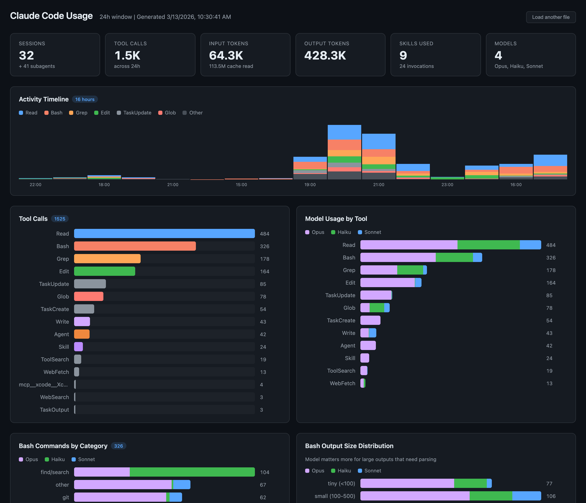

# Claude Code Usage Report

Parse Claude Code session JSONL files and visualize tool calls, model usage, and optimization opportunities in an interactive single-page HTML report.



## Quick Start

```bash
cd claude-usage

# Generate analysis for the last 24 hours
uv run parse-sessions.py --hours 24 --output analysis.json

# Or look back further
uv run parse-sessions.py --hours 72 --output analysis-3day.json
```

Then open `index.html` in a browser and drag-and-drop the generated JSON file onto it.

## What It Tracks

### Tool & Model Usage
- Tool call counts with per-model stacked breakdown
- Skills invoked and which model called them
- Agent dispatches and which model dispatched vs ran them
- Subagent runtime model distribution

### Bash Deep Dive
- Bash commands categorized by type (git, npm, python, file ops, etc.)
- Output size distribution per category and per model
- Average output size as a proxy for "does the model need to understand this?"

### Turn-Level Analysis
- Each assistant API call classified: code read, code write, bash exec, text response, orchestration, task management
- Smart vs mechanical classification — smart turns need reasoning (text output, code generation, orchestration), mechanical turns are pure tool execution
- Average output tokens per turn type as a cost signal

### Smart vs Mechanical Timeline
- Hourly stacked bars showing opus smart, opus mechanical, other smart, other mechanical
- First-half vs second-half trend comparison to measure impact of CLAUDE.md model selection changes
- Use this to track whether `model` parameter guidance in CLAUDE.md is reducing wasted opus turns over time

## Architecture

- **`parse-sessions.py`** — Scans `~/.claude/projects/` for JSONL files, extracts and aggregates usage data, writes a standalone JSON file
- **`index.html`** — Zero-dependency single-page app that accepts drag-and-drop of the analysis JSON and renders interactive charts
- **`analysis.json`** — Generated data file (gitignored), can be shared or archived for comparison
